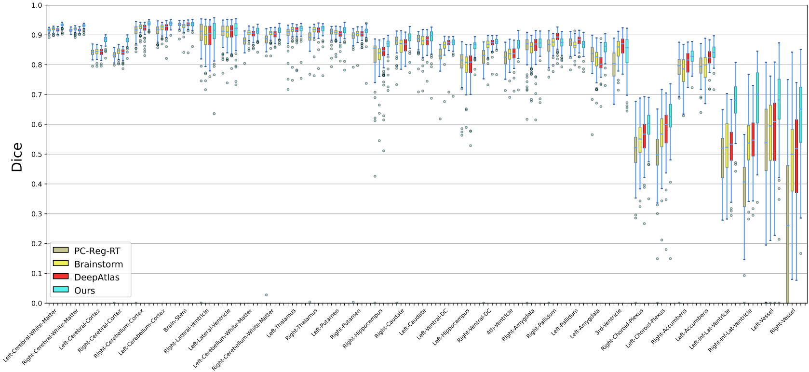
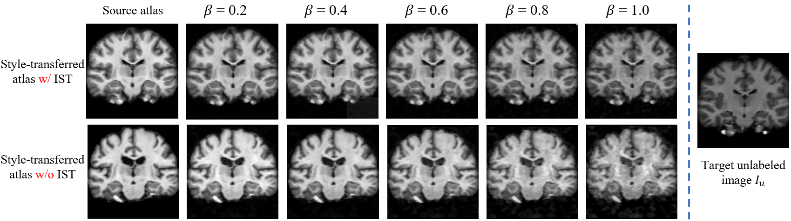
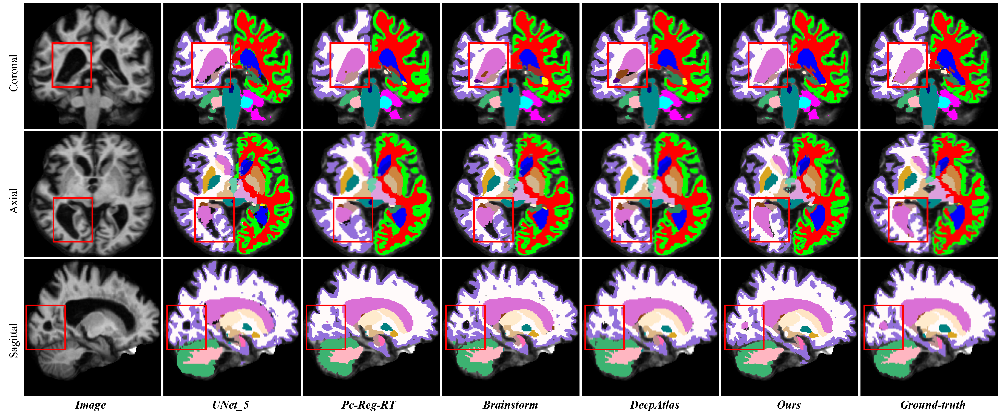
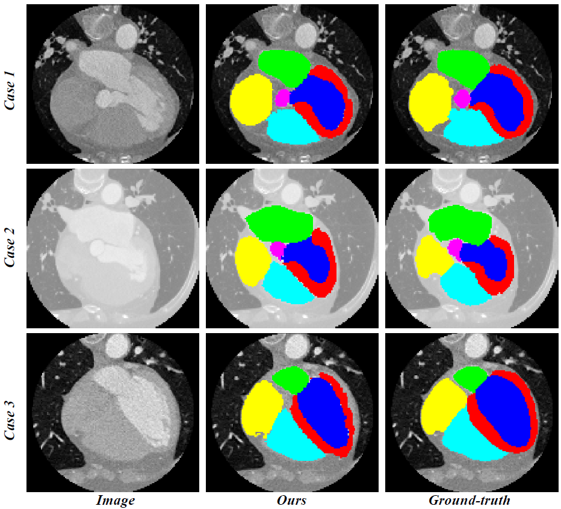

# One-shot-Segmentation-of-Brain-Tissues-via-Image-aligned-Style-Transformation
This is the implementation of the paper "Robust One-shot Segmentation of Brain Tissues via Image-aligned Style Transformation"

## Install
The packages and their corresponding version we used in this repository are listed in below.

- Tensorflow==1.15.4
- Keras==2.3.1
- tflearn==0.5.0

## Training
After configuring the environment, please use this command to train the model.

```sh
python train.py -g 0 --batch 1 -d datasets/brain.json -b PCNet -n 1 --round 10000 --epoch 10
```

## Testing
Use this command to obtain the testing results.
```sh
python predict.py -g 0 --batch 1 -d datasets/brain.json -c weights/Apr06-1516
```

## Pre-processed dataset
We provided the processed two brain MRI dataset, i.e., [OASIS](https://drive.google.com/file/d/1tU42wwc1qLlwJEI3IHcP30XqOtW0j7hb/view?usp=sharing) and [CANDIShare](https://drive.google.com/file/d/1tU42wwc1qLlwJEI3IHcP30XqOtW0j7hb/view?usp=sharing), and a heart CT dataset, i.e., [MH-WHS 2017](https://drive.google.com/file/d/1tU42wwc1qLlwJEI3IHcP30XqOtW0j7hb/view?usp=sharing). Please unzip these files, and move the `xxx.h5` to `/datasets/` folder.

## Pre-trained model
The pre-trained model for [OASIS](https://drive.google.com/file/d/1NndVW8beu-fYjDP2mVsOf-WRnX2NCZUQ/view?usp=sharing), [CANDIShare](https://drive.google.com/file/d/1NndVW8beu-fYjDP2mVsOf-WRnX2NCZUQ/view?usp=sharing), [MH-WHS 2017](https://drive.google.com/file/d/1NndVW8beu-fYjDP2mVsOf-WRnX2NCZUQ/view?usp=sharing) are also available.

## Results
Boxplots of Dice scores of 35 brain regions for comparison of methods. The brain regions are presented under the names and are ranked by the average numbers of the region voxels in decreasing order.


The visualization of our proposed Image-aligned Style Transformation module.


The visualization of segmentation results for different dual-model iterative learning methods. From left to right are raw image, UNet trained with 5 atlas, Pc-Reg-RT, Brainstorm, DeepAtlas, our method, and the ground-truth of segmentation. The implementation of UNet, Pc-Reg-RT, Brainstorm and DeepAtlas are all used their offical released source code.




## Acknowledgment

Some codes are modified from [RCN](https://github.com/microsoft/Recursive-Cascaded-Networks) and [VoxelMorph](https://github.com/voxelmorph/voxelmorph).
Thanks a lot for their great contribution.


